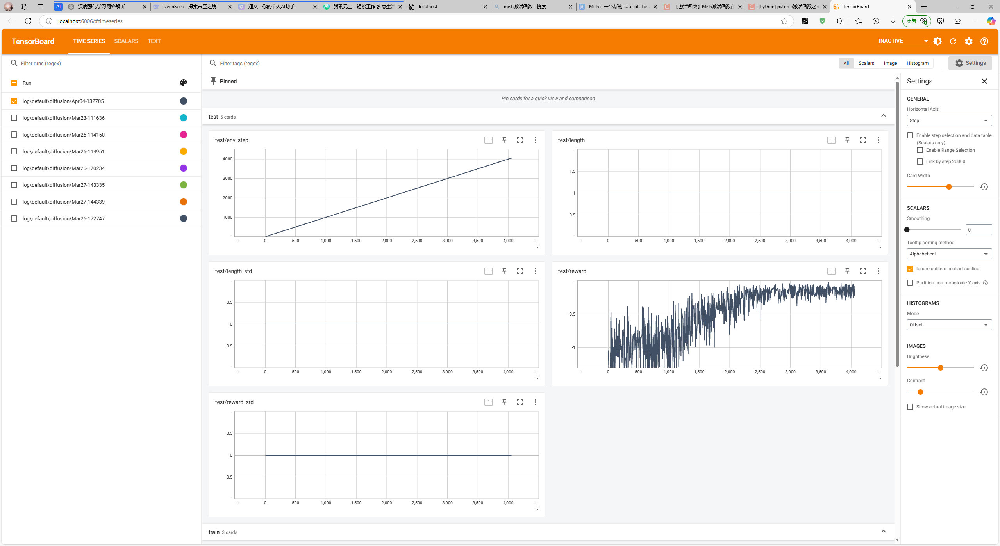
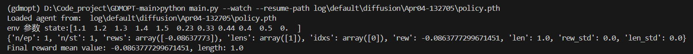
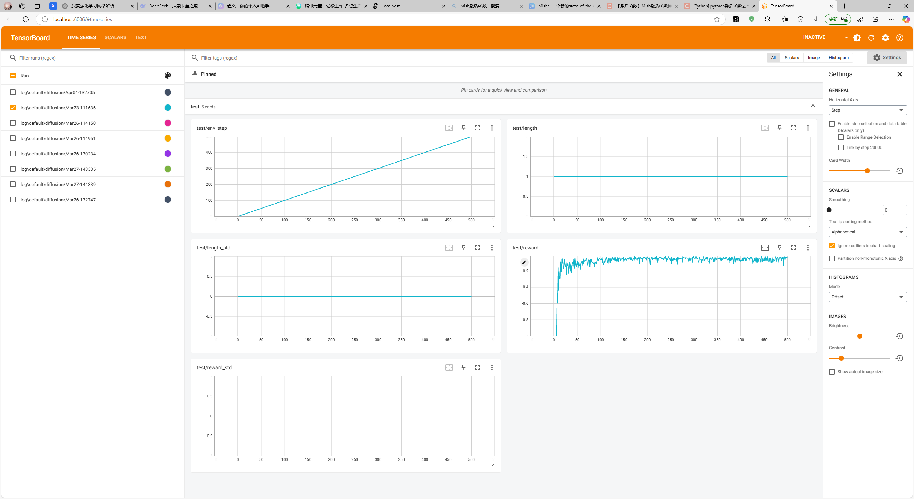
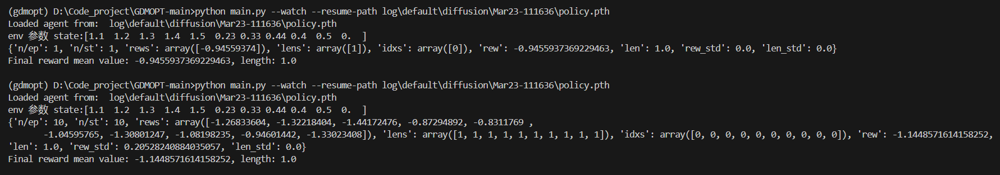
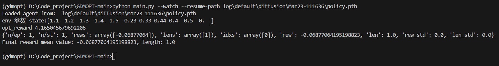
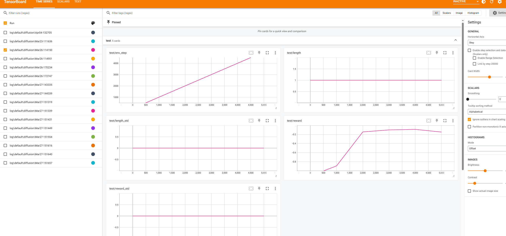
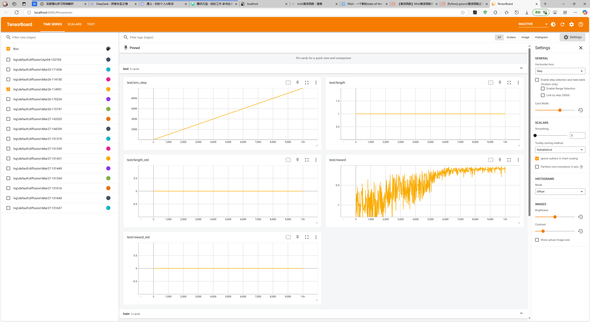
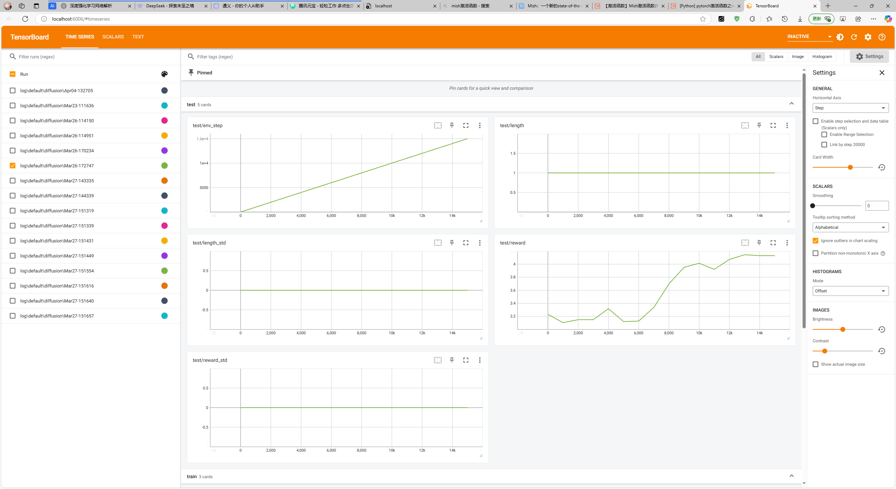
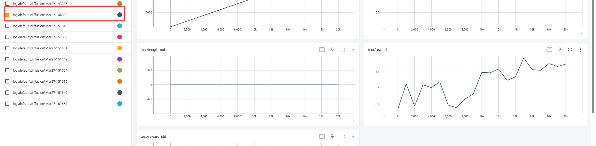
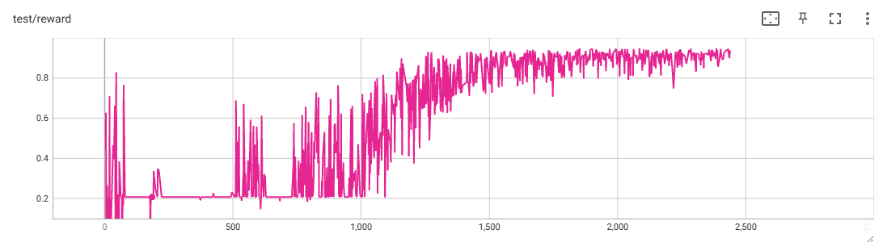

默认都是cpu RTX4060 单张


## 01

项目已训练好的原模型

```python
Namespace(action_shape=10, actor_lr=0.0001, algorithm='diffusion_opt', batch_size=512, bc_coef=0, beta_schedule='vp', buffer_size=1000000.0, critic_lr=0.0001, device='cuda:0', epoch=1000000.0, exploration_noise=0.1, gamma=1, log_prefix='default', logdir='log', lr_decay=False, max_action=1.0, n_step=3, n_timesteps=6, note='', prior_alpha=0.4, prior_beta=0.4, prioritized_replay=False, render=0.1, resume_path=None, rew_norm=0, seed=1, state_shape=11, step_per_collect=1, step_per_epoch=1, tau=0.005, test_num=1, training_num=1, watch=False, wd=0.0001)
```

非固定环境，无专家数据

```python
        states1 = np.random.uniform(1, 2, 5)
        states2 = np.random.uniform(0, 1, 5)
        
        reward = np.sum(data_rate)-sumdata_rate
```




**运行环境**

```
        states1 = [1.1, 1.2, 1.3, 1.4, 1.5]
        states2 = [0.23, 0.33, 0.44, 0.4, 0.5]
        
        reward = np.sum(data_rate)-sumdata_rate
```

**测试结果**



收敛


## 02


```python
Namespace(action_shape=10, actor_lr=0.0001, algorithm='diffusion_opt', batch_size=512, bc_coef=True, beta_schedule='vp', buffer_size=1000000.0, critic_lr=0.0001, device='cuda:0', epoch=500, exploration_noise=0.1, gamma=1, log_prefix='default', logdir='log', lr_decay=False, max_action=1.0, n_step=3, n_timesteps=6, note='', prior_alpha=0.4, prior_beta=0.4, prioritized_replay=False, render=0.1, resume_path=None, rew_norm=0, seed=1, state_shape=11, step_per_collect=1, step_per_epoch=1, tau=0.005, test_num=1, training_num=1, watch=False, wd=0.0001)
```

有专家数据，环境不固定

        parser.add_argument('--bc-coef', default=True) # 有专家数据
        
        states1 = np.random.uniform(1, 2, 5)
        states2 = np.random.uniform(0, 1, 5)
        
        reward = np.sum(data_rate)-sumdata_rate



**运行环境01**

```python
parser.add_argument('--bc-coef', default=False) # 有专家数据

states1 = [1.1, 1.2, 1.3, 1.4, 1.5]
states2 = [0.23, 0.33, 0.44, 0.4, 0.5]

reward = np.sum(data_rate)-sumdata_rate
```

**测试结果**



效果不理想 ，原因是测试的时候`parser.add_argument('--bc-coef', default=False)`参数设置为了`False` 


**运行环境01**

```python
parser.add_argument('--bc-coef', default=True) # 有专家数据

states1 = [1.1, 1.2, 1.3, 1.4, 1.5]
states2 = [0.23, 0.33, 0.44, 0.4, 0.5]

reward = np.sum(data_rate)-sumdata_rate
```

**测试结果**



结果较为理想


## 03

```python
Namespace(action_shape=10, actor_lr=0.0001, algorithm='diffusion_opt', batch_size=512, bc_coef=False, beta_schedule='vp', buffer_size=1000000.0, critic_lr=0.0001, device='cuda:0', epoch=5, exploration_noise=0.1, gamma=1, log_prefix='default', logdir='log', lr_decay=False, max_action=1.0, n_step=3, n_timesteps=6, note='', prior_alpha=0.4, prior_beta=0.4, prioritized_replay=False, render=0.1, resume_path=None, rew_norm=0, seed=1, state_shape=11, step_per_collect=1000, step_per_epoch=100, tau=0.005, test_num=1, training_num=1, watch=False, wd=0.0001)
```

环境不固定，无专家数据，step_per_collect=1000, step_per_epoch=100

```python
states1 = np.random.uniform(1, 2, 5)
states2 = np.random.uniform(0, 1, 5)

reward = np.sum(data_rate)-sumdata_rate
```




**测试环境**

```python
        states1 = [1.1, 1.2, 1.3, 1.4, 1.5]
        states2 = [0.23, 0.33, 0.44, 0.4, 0.5]
        
        reward = np.sum(data_rate)-sumdata_rate
```

**测试结果**

```shell
(gdmopt) D:\Code_project\GDMOPT-main>python main.py --watch --resume-path log\default\diffusion\Mar26-114150\policy.pth
Loaded agent from:  log\default\diffusion\Mar26-114150\policy.pth
env 参数 state:[1.1  1.2  1.3  1.4  1.5  0.23 0.33 0.44 0.4  0.5  0.  ]
{'n/ep': 10, 'n/st': 10, 'rews': array([-0.08686984, -0.08785278, -0.0854859 , -0.18314358, -0.08523343,
       -0.08507486, -0.08906278, -0.0886693 , -0.08442654, -0.08477574]), 'lens': array([1, 1, 1, 1, 1, 1, 1, 1, 1, 1]), 'idxs': array([0, 0, 0, 0, 0, 0, 0, 0, 0, 0]), 'rew': -0.09605947535340839, 'len': 1.0, 'rew_std': 0.02907115934355776, 'len_std': 0.0}
Final reward mean value: -0.09605947535340839, length: 1.0
```


## 04

与01一样

```python
Namespace(action_shape=10, actor_lr=0.0001, algorithm='diffusion_opt', batch_size=512, bc_coef=False, beta_schedule='vp', buffer_size=1000000.0, critic_lr=0.0001, device='cuda:0', epoch=10000, exploration_noise=0.1, gamma=1, log_prefix='default', logdir='log', lr_decay=False, max_action=1.0, n_step=3, n_timesteps=6, note='源代码直接运行', prior_alpha=0.4, prior_beta=0.4, prioritized_replay=False, render=0.1, resume_path=None, rew_norm=0, seed=1, state_shape=11, step_per_collect=1, step_per_epoch=1, tau=0.005, test_num=1, training_num=1, watch=False, wd=0.0001)
```




**测试环境**

```
        states1 = [1.1, 1.2, 1.3, 1.4, 1.5]
        states2 = [0.23, 0.33, 0.44, 0.4, 0.5]
        
        reward = np.sum(data_rate)-sumdata_rate
```

运行结果

```python
(gdmopt) D:\Code_project\GDMOPT-main>python main.py --watch --resume-path log\default\diffusion\Mar26-114951\policy.pth
Loaded agent from:  log\default\diffusion\Mar26-114951\policy.pth
env 参数 state:[1.1  1.2  1.3  1.4  1.5  0.23 0.33 0.44 0.4  0.5  0.  ]
{'n/ep': 10, 'n/st': 10, 'rews': array([-0.06667584, -0.07024412, -0.06401128, -0.23031055, -0.06992698,
       -0.06785797, -0.06554764, -0.067344  , -0.06590832, -0.06474212]), 'lens': array([1, 1, 1, 1, 1, 1, 1, 1, 1, 1]), 'idxs': array([0, 0, 0, 0, 0, 0, 0, 0, 0, 0]), 'rew': -0.08325688186507732, 'len': 1.0, 'rew_std': 0.04905594528128737, 'len_std': 0.0}
Final reward mean value: -0.08325688186507732, length: 1.0
```

 

## 05




**测试环境**

```python
states1 = [1.1, 1.2, 1.3, 1.4, 1.5]
states2 = [0.23, 0.33, 0.44, 0.4, 0.5]

reward = np.sum(data_rate)-sumdata_rate
```

运行结果

```python
(gdmopt) D:\Code_project\GDMOPT-main>python main.py --watch --resume-path log\default\diffusion\Mar26-170234\policy.pth
Loaded agent from:  log\default\diffusion\Mar26-170234\policy.pth
env 参数 state:[1.1  1.2  1.3  1.4  1.5  0.23 0.33 0.44 0.4  0.5  0.  ]
{'n/ep': 10, 'n/st': 10, 'rews': array([-0.04935693, -0.04269869, -0.0414031 , -0.19792287, -0.04188748,
       -0.04475219, -0.05111591, -0.04360429, -0.04254871, -0.04685504]), 'lens': array([1, 1, 1, 1, 1, 1, 1, 1, 1, 1]), 'idxs': array([0, 0, 0, 0, 0, 0, 0, 0, 0, 0]), 'rew': -0.06021452053337617, 'len': 1.0, 'rew_std': 0.04600690857264534, 'len_std': 0.0}
Final reward mean value: -0.06021452053337617, length: 1.0
```


## 06

**训练环境**

```python
Namespace(action_shape=10, actor_lr=0.0001, algorithm='diffusion_opt', batch_size=512, bc_coef=False, beta_schedule='vp', buffer_size=1000000.0, critic_lr=0.0001, device='cuda:0', epoch=20, exploration_noise=0.1, gamma=1, log_prefix='default', logdir='log', lr_decay=False, max_action=1.0, n_step=3, n_timesteps=6, note='reward = np.sum(data_rate) --step-per-epoch=100 --step-per-collect=1000, 环境固定', prior_alpha=0.4, prior_beta=0.4, prioritized_replay=False, render=0.1, resume_path=None, rew_norm=0, seed=1, state_shape=11, step_per_collect=1000, step_per_epoch=100, tau=0.005, test_num=1, training_num=1, watch=False, wd=0.0001)
```

固定环境为, reward为正

```python
states1 = [1.1, 1.2, 1.3, 1.4, 1.5]
states2 = [0.23, 0.33, 0.44, 0.4, 0.5]

reward = np.sum(data_rate)
```


**测试环境**

```python
states1 = [1.1, 1.2, 1.3, 1.4, 1.5]
states2 = [0.23, 0.33, 0.44, 0.4, 0.5]

reward = np.sum(data_rate)
```

**运行结果**

```python
(gdmopt) D:\Code_project\GDMOPT-main>python main.py --watch --resume-path log\default\diffusion\Mar27-143335\policy.pth
Loaded agent from:  log\default\diffusion\Mar27-143335\policy.pth
env 参数 state:[1.1  1.2  1.3  1.4  1.5  0.23 0.33 0.44 0.4  0.5  0.  ]
{'n/ep': 10, 'n/st': 10, 'rews': array([-0.02707094, -0.02572929, -0.02616682, -0.19884002, -0.02760745,
       -0.02842082, -0.02419515, -0.02993965, -0.02774462, -0.02458892]), 'lens': array([1, 1, 1, 1, 1, 1, 1, 1, 1, 1]), 'idxs': array([0, 0, 0, 0, 0, 0, 0, 0, 0, 0]), 'rew': -0.044030368815109536, 'len': 1.0, 'rew_std': 0.05162967624914209, 'len_std': 0.0}
Final reward mean value: -0.044030368815109536, length: 1.0
```


## 07

**训练环境**

```python
Namespace(action_shape=10, actor_lr=0.0001, algorithm='diffusion_opt', batch_size=512, bc_coef=False, beta_schedule='vp', buffer_size=1000000.0, critic_lr=0.0001, device='cuda:0', epoch=20, exploration_noise=0.1, gamma=1, log_prefix='default', logdir='log', lr_decay=False, max_action=1.0, n_step=3, n_timesteps=6, note='reward = np.sum(data_rate) --step-per-epoch=100 --step-per-collect=1000，环境不固定', prior_alpha=0.4, prior_beta=0.4, prioritized_replay=False, render=0.1, resume_path=None, rew_norm=0, seed=1, state_shape=11, step_per_collect=1000, step_per_epoch=100, tau=0.005, test_num=1, training_num=1, watch=False, wd=0.0001)
```

环境非固定为, reward为正

```python
states1 = np.random.uniform(1, 2, 5)
states2 = np.random.uniform(0, 1, 5)

reward = np.sum(data_rate)
```





**测试环境**

```
        states1 = [1.1, 1.2, 1.3, 1.4, 1.5]
        states2 = [0.23, 0.33, 0.44, 0.4, 0.5]
        
        reward = np.sum(data_rate)
    	print('opt_reward',sumdata_rate)
```

**运行结果**

```
(gdmopt) D:\Code_project\GDMOPT-main>python main.py --watch --resume-path log\default\diffusion\Mar27-144339\policy.pth
Loaded agent from:  log\default\diffusion\Mar27-144339\policy.pth
env 参数 state:[1.1  1.2  1.3  1.4  1.5  0.23 0.33 0.44 0.4  0.5  0.  ]
opt_reward 4.165045679692206
opt_reward 4.165045679692206
opt_reward 4.165045679692206
opt_reward 4.165045679692206
opt_reward 4.165045679692206
opt_reward 4.165045679692206
opt_reward 4.165045679692206
opt_reward 4.165045679692206
opt_reward 4.165045679692206
opt_reward 4.165045679692206
{'n/ep': 10, 'n/st': 10, 'rews': array([4.0219308 , 4.03719254, 4.03633988, 3.92597541, 4.04235057,
       4.04136409, 4.02890039, 4.03822581, 4.0075122 , 4.03805726]), 'lens': array([1, 1, 1, 1, 1, 1, 1, 1, 1, 1]), 'idxs': array([0, 0, 0, 0, 0, 0, 0, 0, 0, 0]), 'rew': 4.021784895595023, 'len': 
1.0, 'rew_std': 0.03350290588707676, 'len_std': 0.0}
Final reward mean value: 4.021784895595023, length: 1.0
```


### 使用01原模型进行对比

**测试环境**

实验环境一样

```python
    states1 = [1.1, 1.2, 1.3, 1.4, 1.5]
    states2 = [0.23, 0.33, 0.44, 0.4, 0.5]
    
    reward = np.sum(data_rate)
	print('opt_reward',sumdata_rate)
```

输出结果

```
(gdmopt) D:\Code_project\GDMOPT-main>python main.py --watch --resume-path log\default\diffusion\Apr04-132705\policy.pth
Loaded agent from:  log\default\diffusion\Apr04-132705\policy.pth
env 参数 state:[1.1  1.2  1.3  1.4  1.5  0.23 0.33 0.44 0.4  0.5  0.  ]
opt_reward 4.165045679692206
opt_reward 4.165045679692206
opt_reward 4.165045679692206
opt_reward 4.165045679692206
opt_reward 4.165045679692206
opt_reward 4.165045679692206
opt_reward 4.165045679692206
opt_reward 4.165045679692206
opt_reward 4.165045679692206
opt_reward 4.165045679692206
{'n/ep': 10, 'n/st': 10, 'rews': array([4.09534103, 4.09596658, 4.09078448, 3.97298074, 4.07243185,
       4.09645188, 4.08709612, 4.088629  , 4.06721062, 4.08173295]), 'lens': array([1, 1, 1, 1, 1, 1, 1, 1, 1, 1]), 'idxs': array([0, 0, 0, 0, 0, 0, 0, 0, 0, 0]), 'rew': 4.074862524970589, 'len': 
1.0, 'rew_std': 0.03523506177096092, 'len_std': 0.0}
Final reward mean value: 4.074862524970589, length: 1.0
```


# 自己模型的运行记录

**环境**

```python
Namespace(action_shape=35, actor_lr=0.0001, algorithm='diffusion_opt', batch_size=1024, bc_coef=False, beta_schedule='vp', buffer_size=1000000.0, critic_lr=0.0001, device='cuda', epoch=100000.0, exploration_noise=0.1, gamma=1, log_prefix='default', logdir='log', lr_decay=False, max_action=1.0, n_step=3, n_timesteps=8, note='', prior_alpha=0.4, prior_beta=0.4, prioritized_replay=False, render=0.1, resume_path=None, rew_norm=0, seed=1, state_shape=113, step_per_collect=1, step_per_epoch=1, tau=0.005, test_num=1, training_num=1, watch=False, wd=0.0001)
```

```
环境不变 seed = 1
reward = AMDEP
调整的参数 batch_size=1024
```


**运行结果**

log\default\diffusion\Apr07-134204



